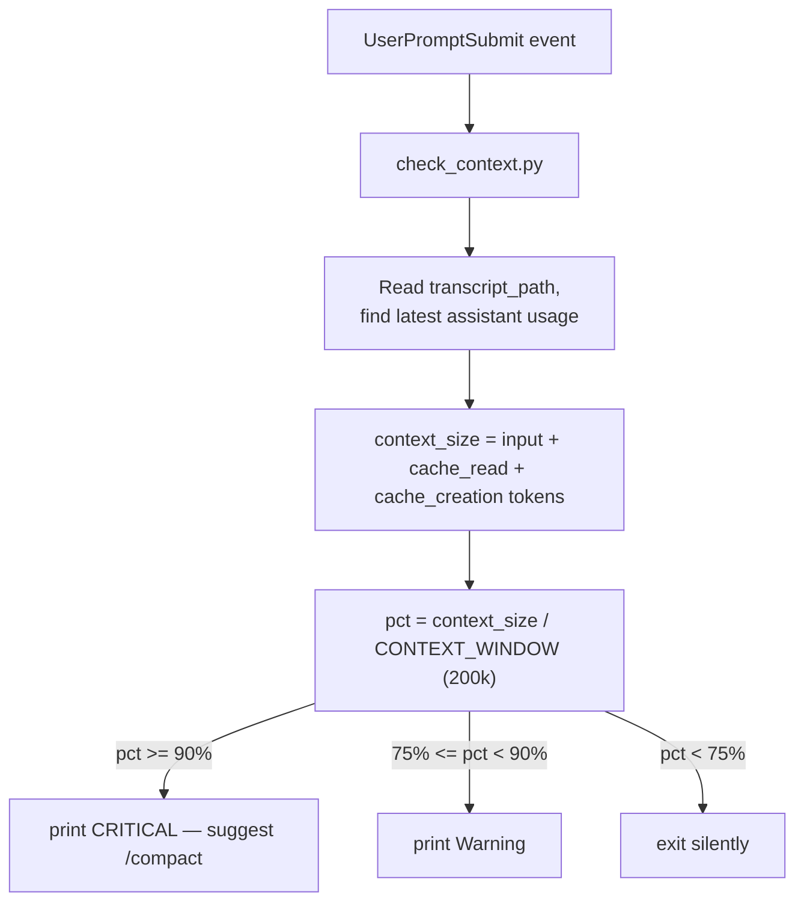

# context-window-check — Claude Code monitoring hook

A single, non-blocking Claude Code hook that watches a session's context
window and prints a short warning once it starts filling up. It doesn't
modify the agent's behavior — it's observational only.

| File | Hook event | Watches for |
|---|---|---|
| `check_context.py` | `UserPromptSubmit` | Context window filling up |

## check_context.py

Runs before each user prompt is processed.

1. Reads `transcript_path` from the hook's stdin JSON.
2. Scans the session's `.jsonl` transcript for the **latest** assistant
   entry's `usage` field and sums `input_tokens + cache_read_input_tokens +
   cache_creation_input_tokens`. That sum approximates how many tokens the
   conversation currently occupies in context.
3. Compares that against `CONTEXT_WINDOW` (200k by default):
   - `>= 90%` → prints a `CRITICAL` line suggesting `/compact`.
   - `>= 75%` → prints a `Warning` line.
   - below 75% → prints nothing (exits silently to avoid cluttering context).

Because it's a `UserPromptSubmit` hook, its stdout on exit 0 is injected
back into Claude's context — so the warning is something the model itself
sees.

## Flow



## Installing the hook

The hook isn't registered anywhere by default — you have to add it
yourself.

### 0. Prerequisites

- Python 3 available as `python` on `PATH` in the environment Claude Code
  runs in. Check with:
  ```
  python --version
  ```
  If your system only has `python3`, use `python3` instead of `python` in
  every command below.
- Know which `settings.json` you're editing (see scope choice next) and
  make a backup copy of it before touching it — a JSON syntax error in
  this file can silently disable *all* hooks/settings it defines, not
  just the one you're adding.

### 1. Copy the file into `.claude/hooks/`, then pick a scope

Claude Code's convention is to keep hook scripts under a `hooks/` folder
inside `.claude/`, not to reference them wherever they happen to sit —
copy `check_context.py` into the `.claude/hooks/` that matches the scope
you pick below.

### Option A: this project only (recommended)

Copy into `.claude/hooks/` at the repo root:

```
mkdir -p .claude/hooks
cp context-window-check/check_context.py .claude/hooks/
```

Then add `.claude/settings.json` (or `.claude/settings.local.json` if you
don't want it committed), with a **relative** path since the working
directory is guaranteed to be the repo:

```json
{
  "hooks": {
    "UserPromptSubmit": [
      { "hooks": [{ "type": "command", "command": "python .claude/hooks/check_context.py" }] }
    ]
  }
}
```

### Option B: every project (global)

The script is self-contained — `transcript_path` arrives on stdin — so it
works unmodified from any project once copied. Copy into your **global**
hooks folder:

- Windows: `%USERPROFILE%\.claude\hooks\`
- macOS/Linux: `~/.claude/hooks/`

```
mkdir -p ~/.claude/hooks
cp context-window-check/check_context.py ~/.claude/hooks/
```

Then edit your **global** settings file (`%USERPROFILE%\.claude\settings.json`
on Windows, `~/.claude/settings.json` on macOS/Linux). Two things matter
here that don't matter for the project-local option:

1. **Use an absolute path.** The global file runs regardless of `cwd`, so
   a relative path like `.claude/hooks/check_context.py` will only
   resolve correctly when you happen to be inside the right project. Use
   the full path to the copy you just made, e.g.
   `C:/Users/<you>/.claude/hooks/check_context.py` (forward slashes work
   fine on Windows and avoid JSON escaping issues).
2. **Merge into the existing `"hooks"` object — don't overwrite it.** If
   your global `settings.json` already defines other hooks (e.g.
   `PreToolUse`, `SessionStart`, or another `UserPromptSubmit` hook), add
   `UserPromptSubmit` as a sibling key inside the same `"hooks"` object,
   and if that key already exists, append to its array instead of
   replacing it.

Example merge (only the new key is an addition; everything else is
whatever was already there):

```json
{
  "hooks": {
    "PreToolUse": [ "...whatever was already there..." ],
    "SessionStart": [ "...whatever was already there..." ],
    "UserPromptSubmit": [
      { "hooks": [{ "type": "command", "command": "python C:/Users/<you>/.claude/hooks/check_context.py" }] }
    ]
  }
}
```

### 2. Validate the JSON before saving

A single missing comma or brace breaks the *entire* settings file, not
just the hook you added — this matters most for the global file since it
may already carry other config (plugins, statusline, other hooks). After
editing, check it parses:

```
python -m json.tool .claude/settings.json
```

(swap the path for your global file if that's the one you edited). If it
prints the JSON back without error, it's valid.

### 3. Restart Claude Code

Hook configuration is read at session startup and cached for the life of
the session — editing `settings.json` while a session is already running
does **not** retroactively apply. Close the session and start a new one
(or open a new project window) after saving.

### 4. Verify it's actually registered and firing

- Run `/hooks` inside the new session — it lists every hook Claude Code
  currently has loaded, grouped by event. Confirm `UserPromptSubmit` shows
  your command.
- Sanity-check the script standalone, independent of the hook wiring, by
  feeding it a fake payload on stdin (this isolates "is my Python script
  correct" from "is the hook wired up correctly"):
  ```
  echo {"transcript_path":"/path/to/a/real/session.jsonl"} | python .claude/hooks/check_context.py
  ```
  (swap `.claude/hooks/` for your global hooks folder if you went with
  Option B)
  A real `transcript_path` can be found under Claude Code's project data
  directory for an existing session. The script exits 0 either way; look
  at stdout for a `[context-check] ...` line.
- Then trigger it for real: send a prompt. Since it only prints output
  once you're past 75% of the context window, you may need a long session
  before you see anything — that's expected, not a sign it's broken.

### Troubleshooting

- **Nothing happens, `/hooks` doesn't list it** → JSON is invalid, or you
  edited the wrong file (project vs. global — check which one Claude Code
  is actually loading), or you didn't start a new session after saving.
- **`/hooks` lists it but it never prints** → the hook is designed to stay
  silent below 75% context usage; that's by design, not a bug. Use the
  stdin sanity-check above with a real (large) transcript to confirm the
  script itself detects the condition.
- **`'python' is not recognized...`** → Claude Code's hook subprocess
  doesn't see the same `PATH` as your interactive shell. Use the full
  interpreter path instead, e.g.
  `"C:/Users/<you>/AppData/Local/Programs/Python/Python312/python.exe .claude/hooks/check_context.py"`.
