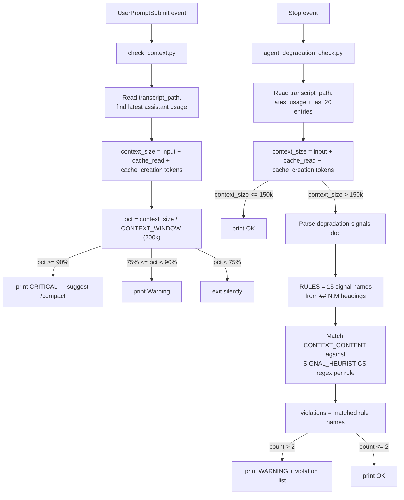

# dumb-zone-40 — Claude Code monitoring hooks

Two independent, non-blocking Claude Code hooks that watch a session for
signs of trouble and print a short `OK` / `WARNING` line. Neither hook
modifies the agent's behavior — they're observational only.

| File | Hook event | Watches for |
|---|---|---|
| `check_context.py` | `UserPromptSubmit` | Context window filling up |
| `agent_degradation_check.py` | `Stop` | Behavioral degradation signals once context is large |
| `Agent_Degradation_Signals_Technical_Documentation.md` | — | Source doc that defines the degradation signals |

## check_context.py

Runs before each user prompt is processed.

1. Reads `transcript_path` from the hook's stdin JSON.
2. Scans the session's `.jsonl` transcript for the **latest** assistant
   entry's `usage` field and sums `input_tokens + cache_read_input_tokens +
   cache_creation_input_tokens`. That sum approximates how many tokens the
   conversation currently occupies in context.
3. Compares that against `CONTEXT_WINDOW` (200k by default):
   - `>= 90%` → prints a `CRITICAL` line suggesting `/compact`.
   - `>= 75%` → prints a `Warning` line.
   - below 75% → prints nothing (exits silently to avoid cluttering context).

Because it's a `UserPromptSubmit` hook, its stdout on exit 0 is injected
back into Claude's context — so the warning is something the model itself
sees.

## agent_degradation_check.py

Runs once per finished assistant turn (`Stop`).

1. Reads `transcript_path`, computes `context_size` the same way as
   `check_context.py` (latest usage's token sum).
2. If `context_size <= WARN_THRESHOLD` (150k tokens by default — matching
   `check_context.py`'s 75% warning line) → prints `OK` and exits.
3. Otherwise it loads `Agent_Degradation_Signals_Technical_Documentation.md`
   and parses every `## N.M Name` / `### N.M Name` heading into a `RULES`
   list — this is how the 15 signals (Context Drift, Hallucinated
   Artifacts, Tool Misuse, …) get pulled dynamically from the doc instead
   of being hardcoded.
4. Builds `CONTEXT_CONTENT` from the text of the last 20 transcript
   entries (assistant text, tool calls, tool results).
5. Evaluates `CONTEXT_CONTENT` against each rule using a curated table of
   **best-effort regex phrase proxies** (`SIGNAL_HEURISTICS`) — e.g. phrases
   like "on second thought" or "let's revisit" proxy for *Context Drift*.
   Any rule from the doc that isn't in the curated table falls back to a
   generic word-match on its own name, so new signals added to the doc
   still produce something.
6. If **more than 2** rules matched → prints `WARNING` with the list of
   violated rule names. Otherwise prints `OK`.

**Important limitation:** this is pattern-matching, not semantic
understanding. It can't actually verify whether a file exists or whether a
decision truly contradicts an earlier one — it's a cheap tripwire, not a
judge.

## Flow



## Installing the hooks

Neither hook is registered anywhere by default — you have to add them
yourself. Full walkthrough below: prerequisites, picking a scope, editing
`settings.json` safely, restarting, and verifying it actually fired.

### 0. Prerequisites

- Python 3 available as `python` on `PATH` in the environment Claude Code
  runs in. Check with:
  ```
  python --version
  ```
  If your system only has `python3`, use `python3` instead of `python` in
  every command below.
- Know which `settings.json` you're editing (see scope choice next) and
  make a backup copy of it before touching it — a JSON syntax error in
  this file can silently disable *all* hooks/settings it defines, not
  just the ones you're adding.

### 1. Copy the files into `.claude/hooks/`, then pick a scope

Claude Code's convention is to keep hook scripts under a `hooks/` folder
inside `.claude/`, not to reference them wherever they happen to sit —
your own global config already does this (`check-graph-first.sh` lives at
`~/.claude/hooks/check-graph-first.sh`). Don't point `settings.json` at
`dumb-zone-40/...` in place; **copy** the files into the `.claude/hooks/`
that matches the scope you pick below.

**Copy all three files together, not just the `.py` you care about.**
`agent_degradation_check.py` resolves the doc path relative to its own
file location (`Path(__file__).resolve().parent / "Agent_Degradation_Signals_Technical_Documentation.md"`),
so if the markdown file isn't sitting right next to it in the same
`hooks/` folder, `load_rules()` silently returns an empty list and the
hook always prints `OK` — never a real `WARNING`, no error either.

### Option A: this project only (recommended)

Copy into `.claude/hooks/` at the repo root:

```
mkdir -p .claude/hooks
cp dumb-zone-40/check_context.py dumb-zone-40/agent_degradation_check.py dumb-zone-40/Agent_Degradation_Signals_Technical_Documentation.md .claude/hooks/
```

Then add `.claude/settings.json` (or `.claude/settings.local.json` if you
don't want it committed), with **relative** paths since the working
directory is guaranteed to be the repo:

```json
{
  "hooks": {
    "UserPromptSubmit": [
      { "hooks": [{ "type": "command", "command": "python .claude/hooks/check_context.py" }] }
    ],
    "Stop": [
      { "hooks": [{ "type": "command", "command": "python .claude/hooks/agent_degradation_check.py" }] }
    ]
  }
}
```

### Option B: every project (global)

Both scripts are self-contained — `transcript_path` arrives on stdin, and
`agent_degradation_check.py` resolves the doc path from its own file
location, not from `cwd` — so they work unmodified from any project once
copied. Copy into your **global** hooks folder:

- Windows: `%USERPROFILE%\.claude\hooks\`
- macOS/Linux: `~/.claude/hooks/`

```
mkdir -p ~/.claude/hooks
cp dumb-zone-40/check_context.py dumb-zone-40/agent_degradation_check.py dumb-zone-40/Agent_Degradation_Signals_Technical_Documentation.md ~/.claude/hooks/
```

Then edit your **global** settings file (`%USERPROFILE%\.claude\settings.json`
on Windows, `~/.claude/settings.json` on macOS/Linux). Two things matter
here that don't matter for the project-local option:

1. **Use absolute paths.** The global file runs regardless of `cwd`, so a
   relative path like `.claude/hooks/check_context.py` will only resolve
   correctly when you happen to be inside the right project. Use the full
   path to the copy you just made, e.g.
   `C:/Users/<you>/.claude/hooks/check_context.py` (forward slashes work
   fine on Windows and avoid JSON escaping issues).
2. **Merge into the existing `"hooks"` object — don't overwrite it.** If
   your global `settings.json` already defines other hooks (e.g.
   `PreToolUse`, `SessionStart`), add `UserPromptSubmit` and `Stop` as
   sibling keys inside the same `"hooks"` object, and if any of those keys
   already exist, append to their array instead of replacing it. Every
   `UserPromptSubmit`/`Stop` event in every project will now run these
   two scripts.

Example merge (only the two new keys are additions; everything else is
whatever was already there):

```json
{
  "hooks": {
    "PreToolUse": [ "...whatever was already there..." ],
    "SessionStart": [ "...whatever was already there..." ],
    "UserPromptSubmit": [
      { "hooks": [{ "type": "command", "command": "python C:/Users/<you>/.claude/hooks/check_context.py" }] }
    ],
    "Stop": [
      { "hooks": [{ "type": "command", "command": "python C:/Users/<you>/.claude/hooks/agent_degradation_check.py" }] }
    ]
  }
}
```

### 2. Validate the JSON before saving

A single missing comma or brace breaks the *entire* settings file, not
just the hook you added — this matters most for the global file since it
may already carry other config (plugins, statusline, other hooks). After
editing, check it parses:

```
python -m json.tool .claude/settings.json
```

(swap the path for your global file if that's the one you edited). If it
prints the JSON back without error, it's valid.

### 3. Restart Claude Code

Hook configuration is read at session startup and cached for the life of
the session — editing `settings.json` while a session is already running
does **not** retroactively apply. Close the session and start a new one
(or open a new project window) after saving.

### 4. Verify it's actually registered and firing

- Run `/hooks` inside the new session — it lists every hook Claude Code
  currently has loaded, grouped by event. Confirm `UserPromptSubmit` and
  `Stop` show your two commands.
- Sanity-check each script standalone, independent of the hook wiring, by
  feeding it a fake payload on stdin (this isolates "is my Python script
  correct" from "is the hook wired up correctly"):
  ```
  echo {"transcript_path":"/path/to/a/real/session.jsonl"} | python .claude/hooks/check_context.py
  echo {"transcript_path":"/path/to/a/real/session.jsonl"} | python .claude/hooks/agent_degradation_check.py
  ```
  (swap `.claude/hooks/` for your global hooks folder if you went with
  Option B)
  A real `transcript_path` can be found under Claude Code's project data
  directory for an existing session. Both scripts exit 0 either way; look
  at stdout for `[context-check] ...` / `agent-degradation-check: ...`.
- Then trigger it for real: send a prompt (exercises `check_context.py`)
  and let a turn finish (exercises `agent_degradation_check.py`). Since
  both only print output once you're past their respective thresholds
  (75% of context window / >2 heuristic matches), you may need a long
  session before you see anything — that's expected, not a sign it's
  broken.

### Troubleshooting

- **Nothing happens, `/hooks` doesn't list it** → JSON is invalid, or you
  edited the wrong file (project vs. global — check which one Claude Code
  is actually loading), or you didn't start a new session after saving.
- **`/hooks` lists it but it never prints** → both hooks are designed to
  stay silent below their thresholds; that's by design, not a bug. Use
  the stdin sanity-check above with a real (large) transcript to confirm
  the script itself detects the condition.
- **`'python' is not recognized...`** → Claude Code's hook subprocess
  doesn't see the same `PATH` as your interactive shell. Use the full
  interpreter path instead, e.g.
  `"C:/Users/<you>/AppData/Local/Programs/Python/Python312/python.exe .claude/hooks/check_context.py"`.
- **`agent_degradation_check.py` always prints `OK`, never `WARNING`, even
  on a huge transcript** → you likely copied only the `.py` file. Check
  that `Agent_Degradation_Signals_Technical_Documentation.md` sits in the
  same `hooks/` folder next to it — without it, `load_rules()` returns no
  rules and the hook has nothing to evaluate.
- **`check_context.py` warning shows up, `agent_degradation_check.py`
  never does** → this is expected even when both are working: on
  `UserPromptSubmit`, stdout at exit 0 is injected into Claude's context,
  so its warning is visible to the model. On `Stop`, stdout at exit 0 is
  *not* injected — it only shows up in the transcript/verbose log, never
  as something Claude "sees". Check transcript/verbose output, not the
  conversation itself.
