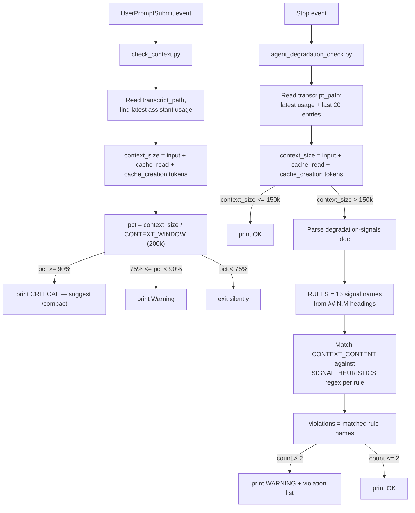

# dumb-zone-40 — Claude Code monitoring hooks

Two independent, non-blocking Claude Code hooks that watch a session for
signs of trouble and print a short `OK` / `WARNING` line. Neither hook
modifies the agent's behavior — they're observational only.

| File | Hook event | Watches for |
|---|---|---|
| `check_context.py` | `UserPromptSubmit` | Context window filling up |
| `agent_degradation_check.py` | `Stop` | Behavioral degradation signals once context is large |
| `Agent_Degradation_Signals_Technical_Documentation.md` | — | Source doc that defines the degradation signals |

## check_context.py

Runs before each user prompt is processed.

1. Reads `transcript_path` from the hook's stdin JSON.
2. Scans the session's `.jsonl` transcript for the **latest** assistant
   entry's `usage` field and sums `input_tokens + cache_read_input_tokens +
   cache_creation_input_tokens`. That sum approximates how many tokens the
   conversation currently occupies in context.
3. Compares that against `CONTEXT_WINDOW` (200k by default):
   - `>= 90%` → prints a `CRITICAL` line suggesting `/compact`.
   - `>= 75%` → prints a `Warning` line.
   - below 75% → prints nothing (exits silently to avoid cluttering context).

Because it's a `UserPromptSubmit` hook, its stdout on exit 0 is injected
back into Claude's context — so the warning is something the model itself
sees.

## agent_degradation_check.py

Runs once per finished assistant turn (`Stop`).

1. Reads `transcript_path`, computes `context_size` the same way as
   `check_context.py` (latest usage's token sum).
2. If `context_size <= WARN_THRESHOLD` (150k tokens by default — matching
   `check_context.py`'s 75% warning line) → prints `OK` and exits.
3. Otherwise it loads `Agent_Degradation_Signals_Technical_Documentation.md`
   and parses every `## N.M Name` / `### N.M Name` heading into a `RULES`
   list — this is how the 15 signals (Context Drift, Hallucinated
   Artifacts, Tool Misuse, …) get pulled dynamically from the doc instead
   of being hardcoded.
4. Builds `CONTEXT_CONTENT` from the text of the last 20 transcript
   entries (assistant text, tool calls, tool results).
5. Evaluates `CONTEXT_CONTENT` against each rule using a curated table of
   **best-effort regex phrase proxies** (`SIGNAL_HEURISTICS`) — e.g. phrases
   like "on second thought" or "let's revisit" proxy for *Context Drift*.
   Any rule from the doc that isn't in the curated table falls back to a
   generic word-match on its own name, so new signals added to the doc
   still produce something.
6. If **more than 2** rules matched → prints `WARNING` with the list of
   violated rule names. Otherwise prints `OK`.

**Important limitation:** this is pattern-matching, not semantic
understanding. It can't actually verify whether a file exists or whether a
decision truly contradicts an earlier one — it's a cheap tripwire, not a
judge.

## Flow



## Wiring into settings.json

Neither hook is registered anywhere by default. Example registration:

```json
{
  "hooks": {
    "UserPromptSubmit": [
      { "hooks": [{ "type": "command", "command": "python check_context.py" }] }
    ],
    "Stop": [
      { "hooks": [{ "type": "command", "command": "python agent_degradation_check.py" }] }
    ]
  }
}
```
